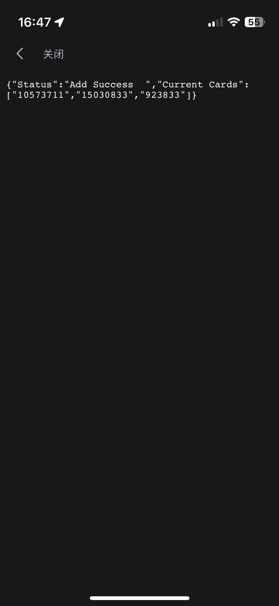
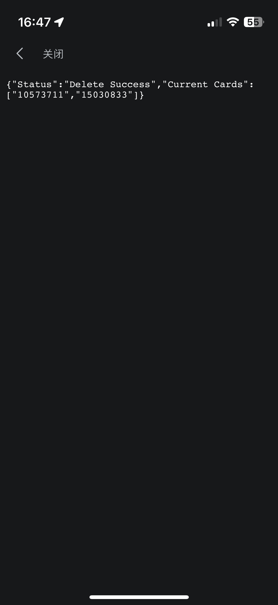

# Surge、QuanX、Loon、Stash 配置

[quanx 一键安装](stash://install-config?url=https://mirror.ghproxy.com/https://raw.githubusercontent.com/Erica-Iris/SQLS/main/Stash/config.yaml)

## 重写

### B 站自定义

#### 安装

quanx、Loon 一键安装: [Bili Live](http://boxjs.com/#/sub/add/https%3A%2F%2Fgithub.com%2FErica-Iris%2FSQLS%2Fraw%2Fmain%2Fboxjs%2FBili.Advanced.json "Bili Live")

#### 实现功能

- [x] 自定义直播间背景
- [x] 在封面处提示直播间默认分辨率
- [x] 可以在直播页面切换不同的直播间，类似赛事的多直播间视角
- [x] 直播间多视角卡片增删功能
- [x] 直播默认原画

#### TODO

- [ ] 更多自定义的开关

#### 使用

    
    
    
    

## 参考文献

[VirgilClyne/iRingo](https://github.com/VirgilClyne/iRingo)

[BiliUniverse](https://github.com/BiliUniverse)

[NobyDa/Script](https://github.com/NobyDa/Script)

## 引用资源

[Orz-3/mini](https://github.com/Orz-3/mini)

## 阿巴阿巴

